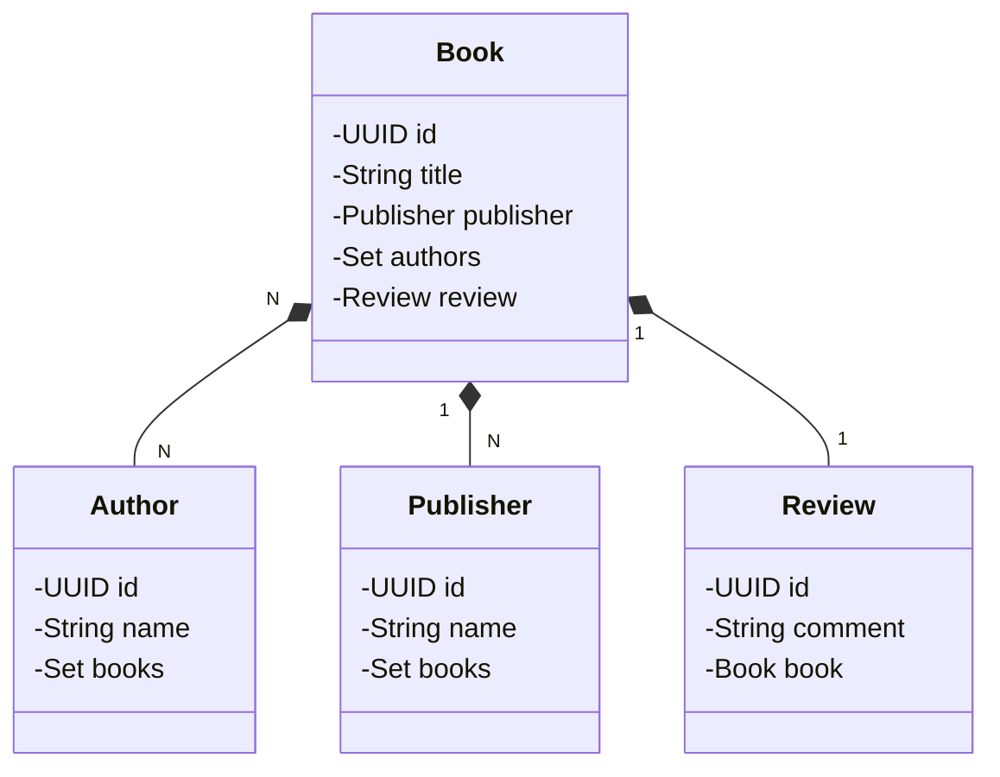

## :construction: - Projeto Bookstore-App
- Livraria Online

##

## 📋 - Diagrama de Classes:

##

### :game_die: - Spring Data JPA:

##

##

## 🛠 - Tecnologias:

As seguintes ferramentas foram usadas na construção do projeto:

- [Java](https://www.oracle.com/java/technologies/downloads/)
- [Maven]
- [Spring]
- [Postman]
- [Postgres]
